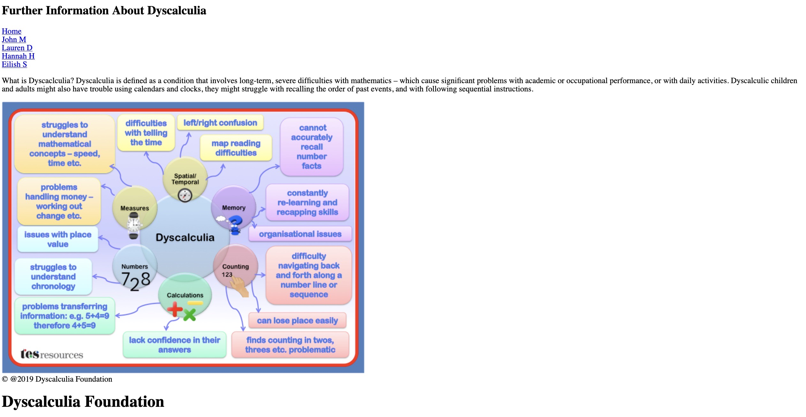

# Inspiring Neurodiverse People

This is a personal project that I am currently working on.

* MVP (Minimum Viable Project)

Inspiring Neurodiverse People will display a list of the people that inspire me from around the world. There will be a picture and name for each of the inspiring people and I will use icons to display an indication of what they do. There will be a navigation bar filled with links to find out further information about these inspiring people, for visitors who are interested in learning more..

On the navigation bar there will be links which will take the user to the page that has more information about that inspiring person. 

As MVP I will start with four inspiring people with the intention to keep building this list.

* Stretch
 
1.	Remove the Dyscalculia image and find a new one. 
2.	Add some styling to the website, for example a navigation bar, header and footer.
3.	Rename the links and add them on the same line rather than underneath each other. 
4.	Move the title that is currently at the bottom of the page, to the top of the page and have that as the header and rename it.  

## Technologies

HTML, Express, React, API’s, HTML, CSS, JavaScript, SQLite, Jest, Node. 

## Under Construction 

